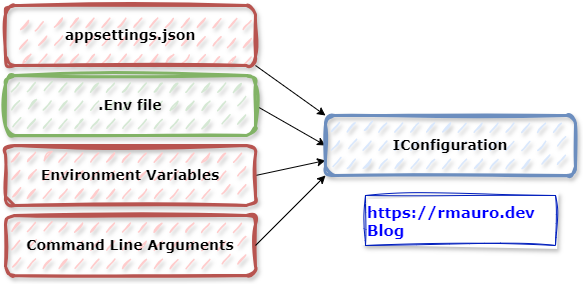

# Demo code of Reading .env Files in C#

- Blog: Reading .env Files in C# : https://rmauro.dev/read-env-file-in-csharp/
- Blog: Load .Env file into IConfiguration Provider : https://rmauro.dev/create-configuration-provider-microsoft-extensions-configuration/
- Blog: Publish C# Project to Nuget.org : https://rmauro.dev/publish-csharp-project-to-nuget-org/

Author: @rmauro.dev



## Nuget.org Package

https://www.nuget.org/packages/Rmauro.Extensions.Configuration.Env/

## Feature List ##

- [X] Create EnvFile Reader
- [X] Add Sample code usage
- [X] Add As Configuration Provider
- [X] Publish as NuGet Package


### For later : Phase-2

- [ ] Automated publish using Github Actions
- [ ] Use DotNet Nuke to build and pack NuGet
- [ ] Create Documentation 


## Tools ##

* Visual Studio Code/Visual Studio 2022 or Visual Code
* DotNet 8

## Framework ##

* No additional frameworks

### Licence ###

* MIT - use it for free

## Author(s)

```javascript
const author = {
  "twitter": "https://twitter.com/ricardodemauro",
  "blog": "https://rmauro.dev"
}
```

## Contribute

- Did you find something that needs improviment - send a `PR` or create an `Issue`
- Did you build something cool - send a `PR`
